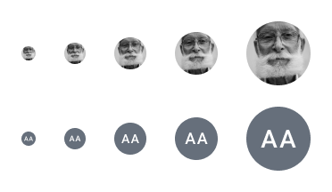
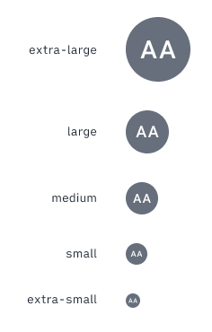

| |  |
|-------------|------------------|
| **Component** | Avatar |
| **Type** | Atom ([?](http://atomicdesign.bradfrost.com/chapter-2/))|
| **Design Spec** | [Link](../images/avatar-spec.png)|
| **Working Examples** | [Link](https://ui.dhis2.nu/demo/?path=/story/utils-user-avatar--default) |
| **Status** | `Ready to use`|

---

# Avatar

An avatar is a visual icon that represents a user.

##### Contents

- [Usage](#usage)
- [Options](#options)
- [Types](#types)
- [Examples in use](#examples-in-use)

---

## Usage
Use an avatar to give extra information when a user is mentioned or displayed in DHIS2. The avatar shows a user uploaded photograph or initials. The avatar is intended to give context and help to identify different users. An avatar is usually shown alongside the user name, but can be used alone to show a visual hint of a user.

---

## Options

### Sizes

Avatars are available in five sizes. The default size is `medium`. Use the size avatar that represents how important the user information is. Often an avatar is supporting information, so it doesn't need to be displayed too large.

---

## Types

There are two different types of avatar depending on the metadata available for a user. If available, the default avatar displays the user uploaded profile picture. If a profile picture isn't available, or suitable, the user initials are displayed (JC for Joe Cooper).

---

## Examples in use

*Avatars are used in comments to highlight that these comments belong to different users, without needing to read the username. The users own avatar shows that they can input data here too.*
