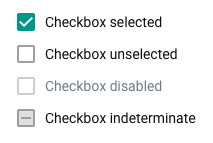

# Checkbox
A checkbox is a control that allows a user to toggle an option.

## Usage
Checkboxes are used when an option can be toggled on or off. Toggling a checkbox on (true) is always considered a positive action and should reflect a positive/true/on state. Multiple checkboxes can be used in a list where a user can toggle multiple elements.

Do not use checkboxes in a list of several options where only a single option can be toggled, use [radio buttons](radio.md) here instead.

#### States
The checked/unchecked/disabled states of a checkbox are self-explanatory. An indeterminate state is used when some, but not all, of the child elements are selected. This state represents a middle ground between checked/unchecked.

An example of an indeterminate checkbox:

#### Sizes

Checkboxes are available in Regular and Dense sizes. Regular size is usually used in forms and whenever a checkbox, or checkboxes, are used standalone. Dense size checkboxes are used inside other complex components, not as main elements of a UI.

## Examples in use

*Checkboxes are used for toggling on/off the display of certain elements. Checkbox status True/On indicates that this element will display*
