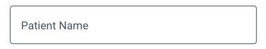
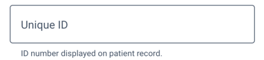
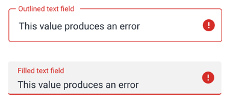
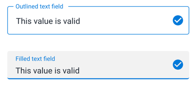
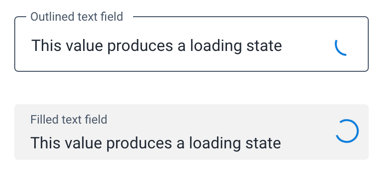

# Input field
An input field is used to input all kinds of information.

## Usage
There are two different types of input field available: outlined and filled. Outlined input fields are the default choice. Both styles are functionally the same, they differ only in visual style.

Outlined input fields are more suited to forms with multiple inputs. Filled input fields work best when used alone or in small groups. Filled input fields also blend into a background more, so they will be less visible to the user. This can be useful for secondary actions like search or filter.

### Labels
The input field label/placeholder text will move to the top of the input field when the user inputs information. This helps the user remember what the input field is used for, without taking up space above the input itself.

Make sure to provide useful label text that is short, concise and describes the intended input.

### Sizes
Input fields are available in Regular and Dense sizes. Regular sizes are best for applications with plenty of space and few controls. Dense sizes work well in data-heavy, complex layouts.

### Help text
Input fields can include helper text below. This helper text provides guideance to the user. Do not use helper text on every form field, this will be overwhelming to the user. Only include help text for difficult to learn, or one-off inputs.

### States

#### Error
An error is indicated with a change of color and inclusion of an ! icon and an optional error message underneath the input. For guidance on writing error messages, see [Content and Communication](../principles/content-communication.md). This error state should only be triggered on inputs that contain an error. Do not apply to the entire form unless all inputs happen to contain an error.

#### Valid
A valid value can be communcated using the 'valid' input field state. This state shows a check icon and adjusts the element color to communicate to the user that the inputted value is value. Only use this field if there are rules/criteria the input must fulfill. Do not use valid inputs for all inputs, and never use a valid input without actually checking for validity.

#### Loading
The loading state is useful for communcating to the user that the application is checking the user entered value and another state will follow, either valid or error. Only use loading states where loading is actually taking place.

## Examples in use

WIP
<!-- 
*Checkboxes are used for toggling on/off the display of certain elements. Checkbox status True/On indicates that this element will display* -->
