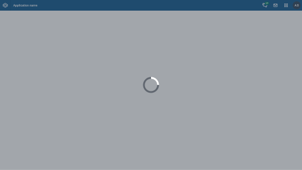
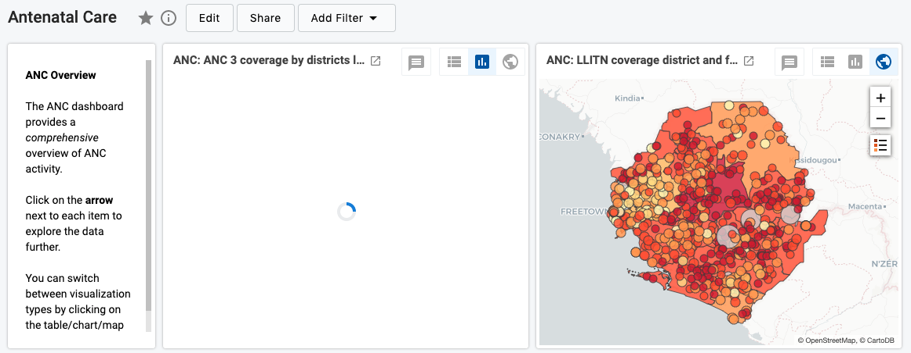
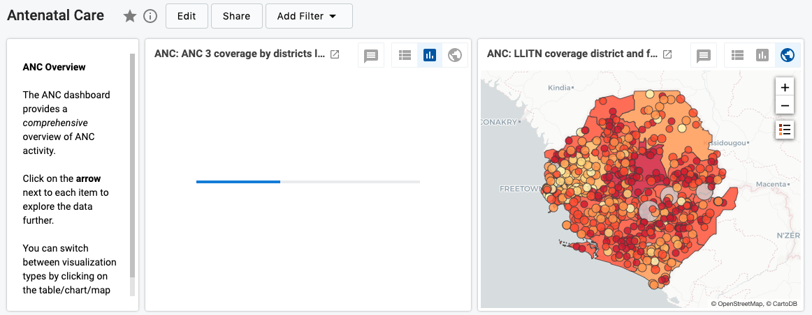

|                      |                                                                       |
| -------------------- | --------------------------------------------------------------------- |
| **Component**        | Loader                                                                |
| **Type**             | Atom ([?](http://atomicdesign.bradfrost.com/chapter-2/))              |
| **Design Spec**      | _pending_                                                             |
| **Working Examples** | [Link](https://ui.dhis2.nu/demo/?path=/story/feedback-loading-indicators-circular-loader--default) |
| **Status**           | `Ready to use`                                                        |

---

# Loader

Use a loader to inform the user that something is in a loading state. This could apply to a single component, several components, or the entire application/page.

##### Contents

- [Usage](#usage)
- [Types](#types)
- [Options](#options)

---

## Usage

Show a loader whenever a component or application takes longer than 700ms to load. After this time, a loader helps the user understand what's happening: loading is in progress. Without a loading indicator a user would be unsure of their current state.

---

## Types

There are different types of loader: circular and linear. For when to use each type of loader, the general rule to follow is:

| Loader   | Usage                                                                                                       |
| -------- | ----------------------------------------------------------------------------------------------------------- |
| Circular | Indeterminate loading, for example when the loading time is uncertain and can't be communicated with a percentage |
| Linear   | Determinate loading, for example when the loading process can be communicated from 0–100%.                         |

### Circular

A circular loader is used when the loading time is uncertain and can't be shown as a percentage. A circular loader can spin many times, and each spin does not represent any amount of completion.

#### Circular page loader

A circular loader can be used to show that an application is loading. In this case, a circular loader is combined with a screen cover, which prevents the user from interacting with the application. Page loaders are always centered in the viewport. If some components have loaded but not others, display component loaders instead and let the user interact with the components that are ready.

_This page loader covers the whole screen while the application loads._

#### Circular component loader

Component loaders are used to show that a component is loading, like a dashboard item that's waiting for data to load. Components loaders are useful to inform the user that while the application or page has loaded, not all the elements are ready yet. Without a component loader, a user can mistakenly think that data is missing or an error has occurred. Circular component loaders should always be centered in the component and include a component cover element to block the content beneath.

_An example of a dashboard item that hasn't loaded yet, so displays a component loader inside._

### Linear

Linear loaders are used when the loading percentage is known. They can be used in the same page and component variations as circular loaders.

_A dashboard item with a linear loader, which shows the user the approximate progress of the loading._

---

## Options

### Inverted

Both circular and linear loaders have an `invert` option, which changes the colors used. The `invert` option should be used when the loader is used on a dark background, like a screen cover.