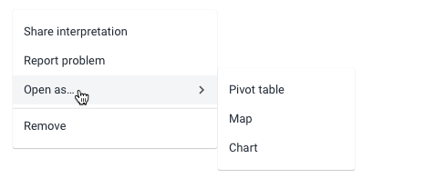
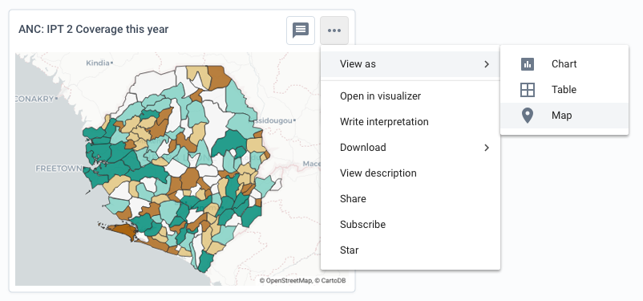

# Menu
A menu provides user access to options that are available when clicking the menu toggle. A menu toggle can be almost anything: button, menu, avatar etc.

## Usage
Use menus to provide access to options and actions where space is limited and displaying all the options would be impractical. For example, providing access to a range of actions for every dashboard item displayed. Containing all those actions in menus keeps the page manageable.

The menu component is flexible in where it can be used and its contents can be flexible too. However, the most common use case is a menu containing menu items.

Menus are available in Default or Dense sizes. Use Dense menus in data-heavy applications used by users comfortable with technology. Use Default menus in apps that are less complex.

### Menu items
Menu items are options or actions contained inside a menu. A menu item contains:

1. **Label, required:** the text of the menu item. Use a concise, understandable word or phrase
2. **Icon, optional:** an icon to help the user quickly understand the context of the menu item
3. **Child arrow, optional:** a child arrow is automatically displayed when a menu item has child menu items.

Make sure the menu item labels are short and easy to understand. One word is often enough to describe an action or option. Do not use sentences as labels. Some examples of good menu item labels:
- "Save"
- "Open as map"
- "Export PDF"
- "Duplicate"

### Menu levels
Splitting menus into several levels with child menus makes sense when there are a lot of options that can be grouped together. An example may be an option in level 1 menu of 'Download' that has several different download formats as child menu items. Make sure that child menu items relate to their parent item, otherwise a user will struggle to discover them. A menu item with children is not selectable/actionable itself, it serves only as a container for the child elements. Try to keep menus to a maximum of 1, 2 or 3 levels, anything more than this can easily confuse the user.

### Ordering and grouping menu items
There is no enforced ordering of menu items, they should be presented in order of relevance. Put the most commonly used items at the top of the menu for easy discovery and access.

Menu items can be grouped together/split with the use of dividers. This makes sense when menu items are somewhat related. A divider can also be used to seperate a critical destructive option like 'Delete', in order to remove it from the regular flow of the menu.

## Examples in use

*Complex actions and options for this embedded analytical object are availble in a menu. If all of these options were available and visible all the time it would be difficult to parse the information on screen.*
