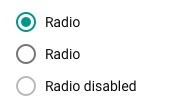

# Radio button
A radio button is a control that allows a user to select a single option from a choice of several.

 

## Usage
Radio buttons are used where a user has the choice of several options but can only select one. Radio buttons should be used when there are 5 or less options available. With more than five a dropdown menu should be used. A user can deselect a radio button by clicking a selected radio button again.

Do not use a radio button if only a single option is available, use a [checkbox](checkbox.md) here instead.

## Examples in use

 
*Only a single style can be chosen from the options and there are fewer than 5 options, so radio buttons suit this usage. *