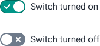

# Switch
A switch is an input control that allows an on and an off state.

## Usage
Switches are used sparingly in DHIS2, as they are not yet an accepted input control on the web. Users are not always used to the concept of a switch, but understanding is growing with wide adoption on mobile platforms.

Use switches only when the user can toggle between on/off. Never use a switch for yes/no or any other states, use a [checkbox](checkbox.md) instead. It is often safer to use a checkbox for things like turning options on/off, as users understand this pattern. Switches can be useful for ongoing or active processes, where turning them on/off makes more sense conceptually. An example of this may be toggling on/off 'Logging' or 'Update automatically', both processes that are ongoing.

<!-- ## Examples in use -->
