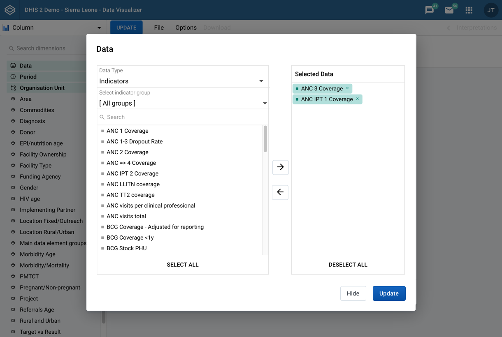
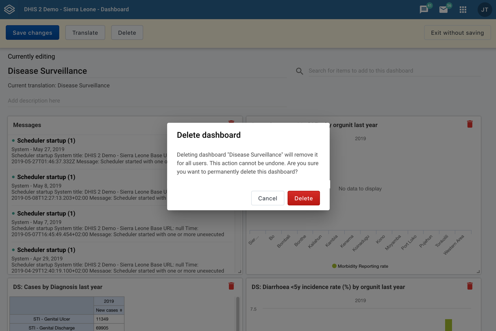

# Modal

A modal is used for displaying information to the user in a focused environment. Modals are well suited when an application requires user input for high-intensity, contained actions.

[Design specs for building available here](https://sketch.cloud/s/DwkDk/jgarwyW)

## Usage
- user response
- critical information
- complete task without losing page

- breaks flow, prevents action, be careful
- should always contain action, not just info, use alert bar instead

A modal takes over the whole screen and presents the user with a focused window. Modals are useful:
- when the application requires a user response to continue.
- if there is critical information that requires that the user take action, else something negative will occur
- if the application wants to allow for user input without leaving the current page

A modal is powerful, taking over the entire screen will break the user's flow. As described above, this can be useful. However, do not overuse modal windows, a user should not feel trapped in modal windows unless they are really required or useful. Never use modal windows just to display information, unless it is absolutely critical. Use an [alert bar](alertbar.md) for displaying information.

### Actions
Modals should always contain actions. These take the form of buttons at the bottom of the modal. Multiple options can be included inside a modal, but a single action should be the focus. For guidance on writing clear, concise actions, see [Content and Communication guidelines](../principles/content-communication.md).

### Sizes

Modals can be set to different sizes. Choose the appropriate modal size for your content. Mismatched sizes can make the user feel that something is missing, or that something is wrong, so choose carefully. If no size is defined, a medium modal will be used. Modal views are always displayed vertically centered in the viewport. Modal sizes are:

### Small, 400px wide

### Medium, 600px wide

### Large, 800px wide

## Composition

A modal is made up of several simple atoms (or parts). Some are optional and some must always be included when using a modal.

1. **Background card, required:** makes up the physical background of the modal itself
2. **Screen cover, required:** covers the screen behind the modal view
3. **Title, optional:** concise, informative title. Should give the user a quick, understandable snapshot of the content in a few words.
4. **Content, required:** the modal content itself. This can be anything, but it must be present. Empty modals are not valid.
5. **Actions, required:** A modal can have a primary action, secondary action, or a destructive action
    1. **Primary action, optional:** A primary action is an affirmative button that confirms or performs an action. Examples “Confirm”, “Send email”, “Add to chart”. Primary actions always use a ‘Primary Button’
    2. **Destructive action, optional:** Similar to a primary action, but negative in nature. Destructive actions always use a ‘Destructive Button’. Examples include ‘Delete data’, ‘Remove from database’.
    3. **Secondary action, required:** All modals must have a secondary action, which is shown in a ‘Secondary Button’. An example of a modal that includes only a ‘Secondary Button’ is a simple, informative modal that requires only an ‘Dismiss’ action.

### Scrolling

A Modals height is defined by its content. All modal sizes are vertically scrollable. When scrolling content inside a modal the header (title, if using) and footer (actions) should always remain fixed and on screen. A modal should have a maxium height of (viewport height - 48px margin top and bottom). Scrollable modals always display a scrollbar.

## Examples in use

*This modal in Data Visualizer app is used to set up the data included in a chart. This is a relatively complex task, so it's contained in a modal for focus. Using a modal means the user doesn't need to navigate away from the current page, an important aspect when they are working on data visualisations. Having these controls on a seperate page would feel very disconnected. Including them right on the page itself would be too messy. A modal is very useful here.*

*Deleting a dashboard displays a confirmation modal. To delete a dashboard is a critical action that could have very serious consequences. The delete confirmation is presented in a modal to focus the users attention on the question: do you really want to delete this dashboard? Notice that the message text is concise and the actions are clear, there is no space for uncertainty with actions like this.* 
