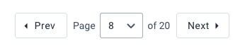
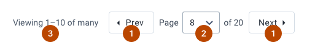
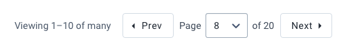
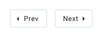
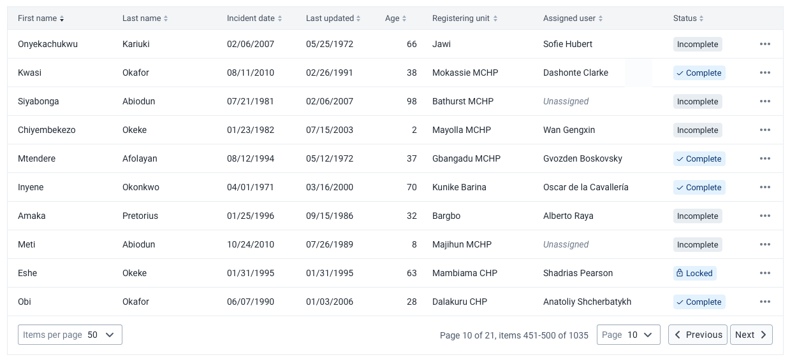

# Pagination
Pagination is used to allow navigation through data displayed over several pages.

[Design specs for building pagination](https://sketch.cloud/s/DwkDk/a/pmVrZo)

## Usage
Pagination allows data to be split in pages. Paging large amounts of data avoids overwhelming users and should always be used wherever a lot of data is displayed. Pagination controls allow a user to browse through a set of data or navigate to a specific page depending on the type of pagination used.

## Composition

The pagination component is made up of several elements, some of which are optional:

1. **Previous & Next buttons, required**
2. **Page control dropdown, optional**
3. **Context information, optional**
4. **Result count selector, optional**

### Types
Different types of pagination are available by including different elements:

#### Pagination with context

All elements are included, the user can page using the previous and next buttons or select a page from the dropdown. Context of which data is in view is included. This full component is useful for large datasets.

#### Compact pagination

Smaller datasets might not need full pagination controls. By only including the previous and next buttons a much simpler, compact component is available.

#### Full pagination

Including all of the pagination elements results in a full-featured pagination control.
## Examples in use

*Full pagination is used to view and navigate search results in Capture app.*

---
