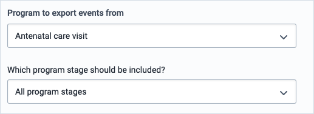
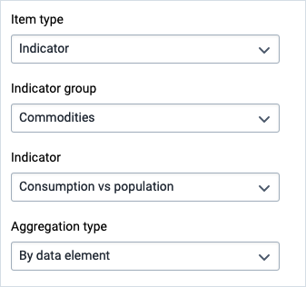

|                      |                                                                          |
| -------------------- | ------------------------------------------------------------------------ |
| **Component**        | Select                                                                   |
| **Type**             | Molecule ([?](http://atomicdesign.bradfrost.com/chapter-2/))             |
| **Design Spec**      | [Link](https://sketch.cloud/s/DwkDk/a/Q5EqdY)                            |
| **Working Examples** | [Link](https://ui.dhis2.nu/demo/?path=/story/forms-single-select-single-select--with-options-and-on-change) |
| **Status**           | `Ready to use`                                                           |

---

# Select

The select component allows selection of one or more options from a list.

##### Contents

- [Usage](#usage)
- [Options](#options)
- [States](#states)
- [Examples in use](#examples-in-use)

---

## Usage

Use a select component wherever the user needs to make a selection of one or more options from a list of 6 or more options. If there are less than 6 options to choose from and space permits, use [checkboxes](../atoms/checkbox.md) for multiple selection and [radio buttons](../atoms/radio.md) for single selection. If the user needs to make a complex selection with a specific ordering, use a [transfer](../organisms/transfer.md) instead.

---

## Options

### Single selection

The default functionality of a select component allows for a single selection. The user clicks in the input field to open a menu that displays a list of options. The user selects an option and the menu closes. The input now displays the selected option.

### Multiple selection

Multiple selection allows the user to select more than one option from the list. Checkboxes are used to highlight the possibility of making more than one selection. Selected options are displayed as chips inside the input. Make sure to communicate clearly to the user if there is a limit to the number of selectable elements.

Use multiple selection wherever the user needs to make more than one selection. If the multiple selection is complex, requires a defined order or needs to made from different groups, consider using a transfer(WIP) component instead.

### Filtering

Filtering allows the user to search in the available options. The filter input appears above the options and remains fixed on top when scrolling a long list of options.

Use filtering if there are many options to choose from. There is no minimum amount of options needed before filtering is needing, it also depends on the complexity of the options. If a user may struggle to find the right option, include filtering. Make sure to provide meaningful feedback to the user if there are no options available when filtering, the user should never wonder why there are no options in the list.

### Custom content

By default a select component uses a simple menu to display options, however options can be customized to display in any way. In the example above the options include an icon, title and description. The 'selected' state of an option can also be customized, the example above uses a custom color background and check icon.

The selected state of the input can also be customized. An option title must always be provided, this title will be displayed in the input when selected. Optional graphics or icons can also be included. Do not use large graphics and make sure any icons used communicate clearly with the user.

Use custom content whenever a short text option would be insufficient or not communicate clearly enough. However, keep in mind that if the content is very complex it should not be contained within a menu as this may be difficult to navigate and view. In this case, use a custom component instead of a select.

### Clearable single select

An optional 'clear' control can be included on select components. The purpose of this control is to allow users the option of clearing the selected option, rather than having to refresh the page to reset the component.

'Clear' functionality should be included on a non-required select if there is not a 'No selection' option provided in the list.

### Inline label

An inline label is a placeholder text that persists after the user has made a selection. The inline label communicates the purpose of the field after a selection has been made, where it might not have been obvious otherwise. In the example above, 'Sort by' is used an inline label because displaying only the selected option 'Status' would not have communicated the purpose of the field to the user. Inline labels are used instead of a label above the input field.

Only use inline labels on select components that are displayed in toolbars and space restricted areas. Inline labels must be short and concise.

---

## States

### Empty

The select menu displays an empty state if there are no options to display, perhaps due to a lack of data. An empty state is not an error state, it is displayed only when a lack of data can be confirmed.

Use the empty state to provide useful information to the user and, where possible, help them fix the issue. In the example above the empty state informs the user that no programs exist and provides them with a link to create a new program directly from the select component. Only include simple, one click actions in the select empty state, do not attempt to include complex flows inside the menu. A select menu empty state should never be the only place to carry out an action, rather it is a helpful shortcut.

---

## Examples in use

_Selects are used for program and stage selection in Import/Export app. Selects work well here because the total number of options is not known and will differ greatly between different implementations._

_Multiple selects are used to choose data for map layers in Maps app. Again, the number of options is not known so a select is the safe choice. Dense selects are used as these controls are displayed alongside others in a modal._

_Size and position options are provided using dense selects with a prefix label. The dense size and the prefixed labels use minimal space and allow for an information dense set of controls. These controls are used alongside others inside a modal view in Data Visualizer app, so it is important they do not use a lot of space._
