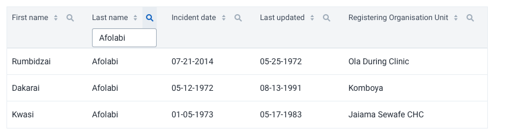
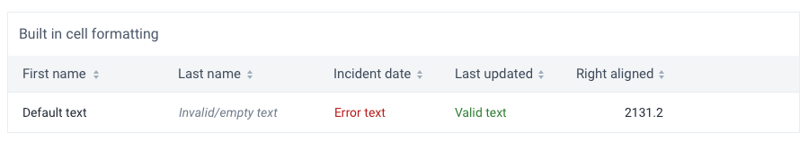

|                      |                                                                     |
| -------------------- | ------------------------------------------------------------------- |
| **Component**        | Data table                                                          |
| **Type**             | Organism ([?](http://atomicdesign.bradfrost.com/chapter-2/))        |
| **Design Spec**      | [HTML&CSS spec](https://sleepy-yalow-3c0c76.netlify.com/data-table) |
| **Working Examples** | [Link](https://ui.dhis2.nu/demo/?path=/story/data-display-datatable--default)                                                          |
| **Status**           | `Ready to use`                                                  |

---

# Data table

Data tables display data in a structured way, with functionality for viewing and manipulating data.

##### Contents

- [Usage](#usage)
- [Composition](#composition)
- [Options](#options)
- [Types](#types)
- [States](#states)
  <!-- - [Examples in use](#examples-in-use) -->

---

## Usage

 Data tables are well suited for displaying and interacting with a lot of data. Only use data tables when they meet a user need because a data table full of complex data can be overwhelming. Consider if an application could display the information in a user-friendly, understandable way, rather than the raw data output.

Data tables offer varied functionality and options. The right type of data table to use depends on the use case and type of data. This document outlines the component functionality and options.

### Data table or Table?

There are two similar components, a *data table* and a *table*. The difference is:
- A *data table* shows dynamic data that can be filtered and manipulated.
- A *table* shows static information that can't be changed.

---

## Composition

A data table is made up of several elements, some of which are optional:

1. **Toolbar, optional**
2. **Data rows and header, required**
3. **Footer, optional**

---

## Options

### Search

##### What is search?

Search helps a user find a items that match a specific term, matched across the whole data table.

##### How is search used?

A search input can be placed inside the table toolbar area or outside of the table. The location of the search input depends on the importance of search and how it relates to the task. If searching is a logical step performed before looking at the table, then the search box can be outside and above the table. If searching is a secondary action, then it can be included inside the table toolbar.

Keep the user informed with an [empty state](#empty-state) if there are no results for a search term.

##### When to use search?

Include search whenever a user might need to find a specific data item in the table. Search can be quicker than filtering if the user knows what data item they're looking for. Search and filtering usually work well in combination.

---

### Filtering

Filtering is a way to view a precise set of data. Filtering is an effective way of finding the right data by eliminating data that isn't relevant. With filtering, a single data table can meet different needs for different users and use cases.

Filtering works best when a user wants to find some data that fits some criteria. If a user is looking for a single result, especially when they know a its name or other attribute, then offer search functionality outside of the table.

It's important that the user knows the data is being filtered. Use a text label to highlight the filtered state, and offer a way of removing the filters. Never filter data in a table without informing the user.

There are different ways to filter data in a data table: [standalone](#filtering-standalone) or [inline](#filtering-inline).

### Filtering: Standalone

##### What are standalone filters?

Standalone filters are controls that aren't part of the data table. Standalone filters aren't included in the data table component, but are mentioned here for their close relation.

##### How are standalone filters used?

Standalone filter controls might be in a sidebar next to the table, or above the table in collapsible panel.

##### When to use standalone filters?

Standalone filters are useful when filtering is the main action on a page. Standalone filters draw user attention and are easier to use for lower tech literate users.

### Filtering: Inline

##### What are inline filters?

Inline filters are a compact way of filtering data inside the data table.

##### How are inline filters used?

The filter control for a column is displayed when clicking the filter icon in the column header. Several columns can be filtered at the same time.

##### When to use inline filters?

Use inline filters in data-heavy, compact tables where standalone filters would take too much space or interfere with the rest of the page. Inline filters work well when filtering isn't one of the main actions on a page, but rather something used occasionally.

---

### Table actions

##### What are table actions?

Actions for the whole data table, or a selection of data rows.

##### How are table actions used?

Table actions are buttons in the toolbar area. Show important, often used actions as individual buttons (*Export data* and *Print* in the example above.) Show other, less used options a dropdown button with a button label like *Actions*, *More* or the three-dot icon.

##### When to use table actions?

Only show actions in the toolbar that apply to the data in the data table, not to the rest of the interface.

Table action buttons will stand out in an interface, so only include actions that apply to most use cases. Rarely used options can be shown inside a *More* dropdown button to avoid cluttering the interface.

---

### Sorting

##### What is sorting?

Sorting changes the order of rows in a data table, based on column contents. Columns can be sorted ascending (A-Z, for example) or descending (Z-A, for example).

##### How is sorting used?

Column headings with sorting enabled can be clicked to sort the table data by that column.

##### When to use sorting?

Sorting is useful and should be enabled for most data tables. Only disable sorting if the data order is intentional and therefore shouldn't be changed.

---

### Fixed header

##### What is a fixed header?

A table header that stays in view when vertically scrolling a data table.

##### When to use a fixed header?

Fixed headers are useful for browsing data in limited space where the header would otherwise be hidden. Keeping the headers visible helps users remember what each column shows.

---

### Fixed columns

##### What are fixed columns?

Columns that stay in view when horizontally scrolling a table. In the example above, the first two columns are fixed and the rest of the table scrolls horizontally.

##### When to use fixed columns?

Use fixed columns when space is limited and the table might be scrolled horizontally to see all the columns. Keeping one or more columns fixed helps the user to keep track of rows. Use fixed columns on columns with unique values, like a name or ID, so that it's easy to tell each row apart.

---

### Inline editing

##### What is inline editing?

Cells that can be edited in the data table without going to another page.

##### How is inline editing used?

Editable cells display an edit icon after the cell value.

The suggested pattern is that clicking an editable cell opens a popover with editing controls. Always make it clear to the user how they save their data: is data saved automatically or when clicking a *Save* button? Using a *Save* button is an easy to understand pattern.

Clicking an editable cell starts the edit process. The interface for editing should match the use case. For example:

- editing a single value: display a popover with a control and buttons,
  
- editing a complex value: display a modal with all the required inputs.

##### When to use inline editing?

Inline editing is especially useful for expert users. They can edit data without leaving the data table. However, inline editing can be overwhelming for some users and can be difficult when working with large data sets. Inline editing can be confusing if data values have to be validated or if editing values has consequences for other values not in the data table. An unreliable network can make inline editing difficult as the difference between saved, synced or failed might not be clear.

---

### Expandable rows

##### What are expandable rows?

Table rows that can be expanded to show more information and actions.

##### How are expandable rows used?

Clicking on the arrow in the first cell toggles an expandable row.

##### When to use expandable rows?

Expandable rows are useful when there is a lot of useful information to display, more than fits comfortably in a row on an average sized screen. An expandable row can show this information without navigation. This pattern works well for reference screens where a user might be checking several items. Expandable rows also work well for information that can't be shown in a table cell like paragraphs of text or videos.

---

### Selectable rows

##### What are selectable rows?

Table rows that have a *selected* state and control.

##### How are selectable rows used?

Rows can be selected with a checkbox. The checkbox control in the header selects and deselects all rows.

Selected rows can have actions applied to them from the table actions. A different set of actions can be shown when some rows are selected. Include a *deselect* option too.

##### When to use selectable rows?

Use selectable rows when it's useful to do something to several table rows in one action. Actions like *delete* and *download* are often useful with selectable rows.

---

### Reordering rows

##### What is row reordering?

Table rows that can be dragged to change their order.

##### How is row reordering used?

When row reordering is enabled, clicking a row starts dragging. If the row requires more actions they should be included in a clickable cell that doesn't trigger dragging.

##### When to use row reordering?

Only use row reordering where changes to the order will have a permanent and meaningful effect on the items in the data table.

---

### Editable columns

##### What are editable columns?

The ability to change the columns and their order in a data table.

##### How are editable columns used?

A button in the toolbar, with a label like *Manage columns*, is a common pattern. The button opens a modal with controls for toggling and reordering columns.

##### When to use editable columns?

Editable columns make data tables flexible. A single data table can show different data to different users in different situations.

However, editable columns shouldn't be always be used, there should be a clear use case. Editable columns adds complexity (both for the user and the application) and makes it possible to get into unintended states. 

---

### Bordered cells

Bordered cells are useful for displaying complex data with similar values. For example, a table displaying number values can use bordered cells to help visually separate values. Tables where rows represent one *record* with different value types (such as name, address, age) don't need borders.

---

### Built-in formatting

Several built-in text styles are available. Technically, a cell can show any type of content with any style, but using these styles helps keep consistency across DHIS2 applications.

---

### Status

It can be useful to display an item's status in a data table. Statuses offer quick comparison between rows and help highlight important data items.

Use [tags](../atoms/tag.md) to display statuses in data tables. Be sure to follow the usage guidelines for tags.

Only display status when it's relevant. Don't display status unless several statuses are available. For example, don't display statuses if the only status available is 'Active'.

---

### Large cells

Large cells use a bigger font-size and cell height. Use large cells where users see a small amount of data, or where they might be intimidated by a compact view of data.

---

### Combining options

The options listed above offer flexible, powerful data tables. However, there are some combinations of options that are confusing or difficult to use. Keep data tables focused on the relevant task. Consider the following guidelines:

- Avoid using `expandable` and `reordering` together. The drag and drop interaction relies on unchanging row height, and expandable rows offer dynamic heights that makes dragging rows into place harder.
- Avoid using `expandable` and `bordered` together. The cell borders will confuse the relationship between the table row and it's expanded content. 

For all data tables, only include options that meet user needs. Using unnecessary table options will create confusing data tables.

## States

### Empty state

An empty data table should communicate helpful information. If there isn't any data, don't only show an empty table, show a useful empty state. Sometimes it makes sense to hide an empty table, but in most situations it's best to show an empty state.

The component empty state is flexible and accepts any elements. A common pattern is to show informative text and an action. Without an action, it can be difficult for the user to fix the cause of the empty data. For example, if there are no patients registered in a program then the action could be *Register a patient*. Sometimes it's best to use the empty state to guide the user to an action somewhere else in the interface (*Click the button above to get started*, for example). This helps users learn by doing.

---

## Examples in use

_A data table shows technical information in the SMS configuration app. There might be many items, so a data table is used to offer quick scanning and filtering._
