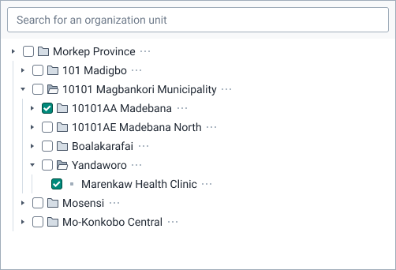
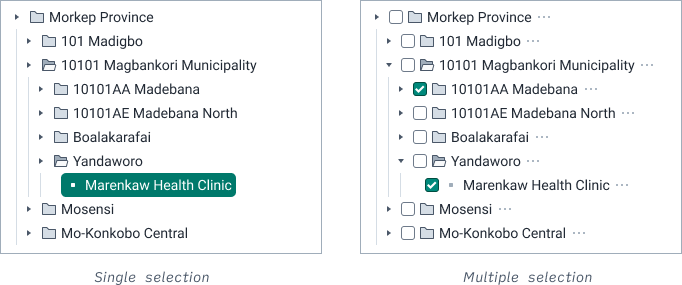

|                      |                                                            |
| -------------------- | ---------------------------------------------------------- |
| **Component**        | Organization unit tree                                            |
| **Type**             | Organism ([?](http://atomicdesign.bradfrost.com/chapter-2/)) |
| **Design Spec**      | _pending_                                                  |
| **Working Examples** | [Link](https://ui.dhis2.nu/demo/?path=/story/forms-organisation-unit-tree--collapsed)                                                  |
| **Status**           | `Ready to use`    |

---

# Organization unit tree

Displays a hierarchical, interactive tree of organization units that allows selection and manipulation.

##### Contents

- [Usage](#usage)
- [Options](#options)

---

## Usage

Use an organization unit tree wherever a user needs to select an organization unit (referred to from here as _unit_). Units are displayed in a expandable and collapsible tree that reflects their hierarchy levels. 

---

## Options

### Selection mode

An organization unit tree can offer either single or multiple selection of units. Use the single selection option if the user only needs to select a single unit, for example when choosing where to report data. Use the multiple selection option if the user wants to act upon multiple units, for example when choosing which units have access to a program.