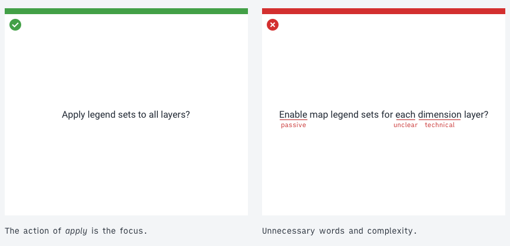
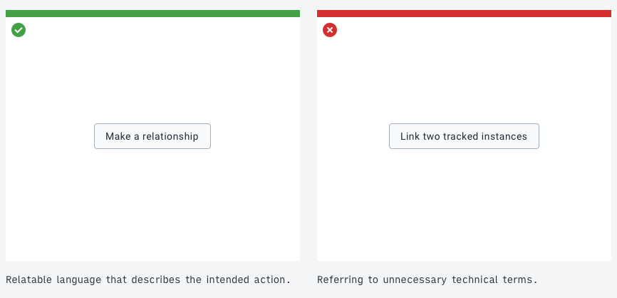
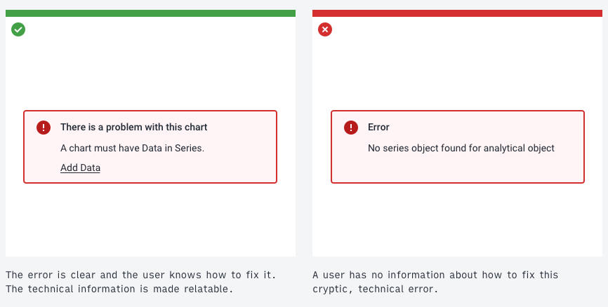
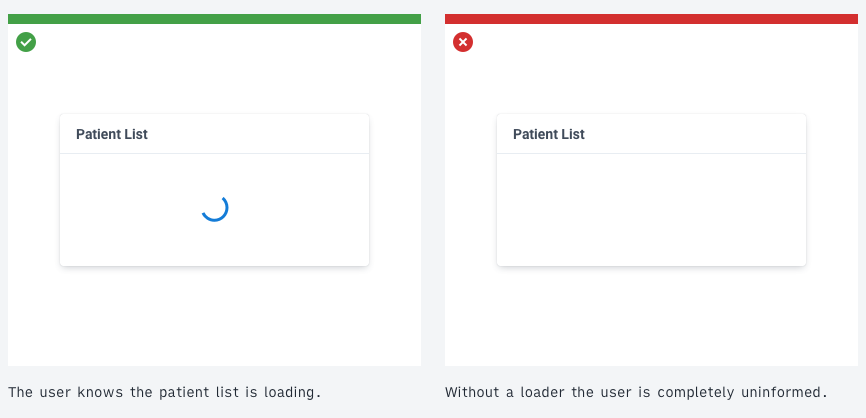
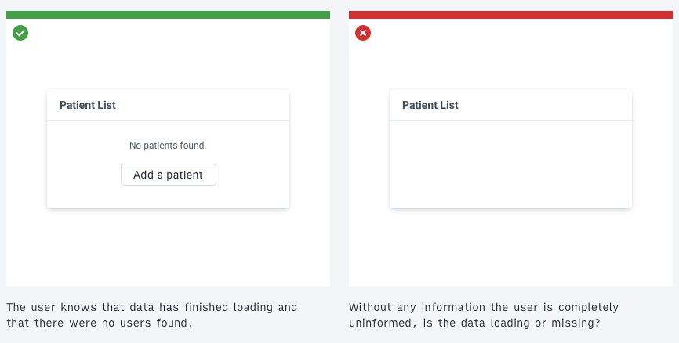
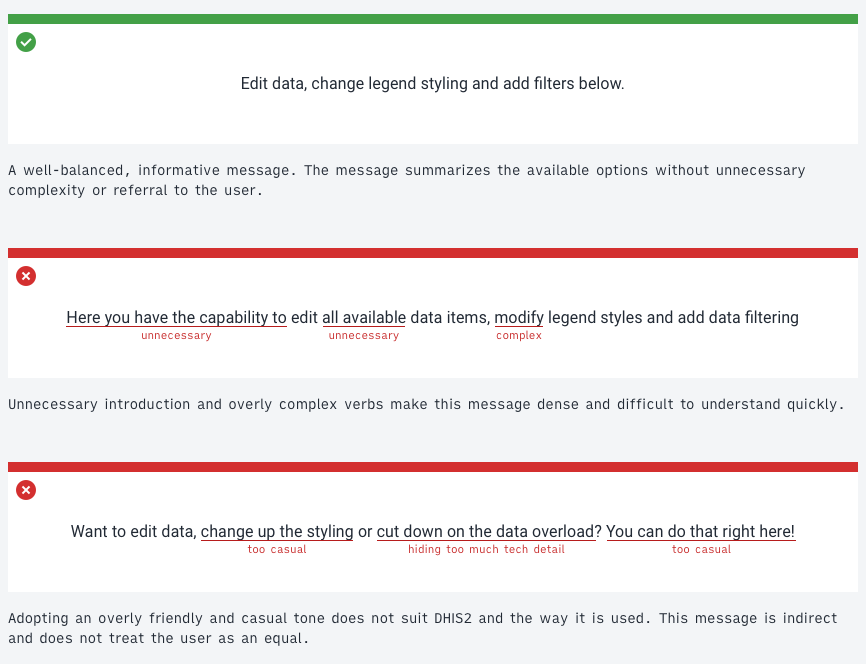
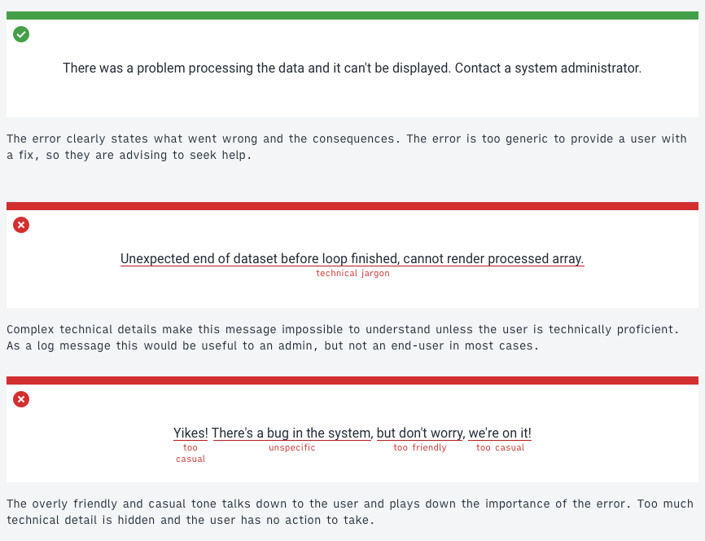

# Content and communication

Communicating consistently helps DHIS2 users understand, use and extend DHIS2. Follow these principles, each of which is expanded below:

- Use words that are easy to understand, consistent and not overly technical.
- Help the user to build a mental model of the DHIS2 platform and applications
- Communicate errors clearly and with guidelines or actions
- Keep the user informed about application status
- Use a clear, honest and friendly tone of voice
- Only refer to a user, using _you/your_ when necessary.

## Communication

Use understandable, consistent language when communicating with a user. Offer information that's relevant and useful. Avoid unnecessary confusion by communicating in clear terms. Don't talk down to users, regardless of their technical ability.

Keep communication concise and to the point. Don't try to guide the user through all parts of an interface, the interface should speak for itself. A short introductory text for sections within an application is enough to give the user context to explore further. Where more guidance is necessary, refer the user to the relevant documentation.

For example, when prompting a user to confirm an action:

 

The correct example is clear, still providing enough detail about the consequences. Focusing on the intended action: applying legend sets to layers, makes the text easier to understand. The incorrect example uses several unnecessary words, DHIS2 technical terms and passively states the action. The correct example directly states the action and consequences.

## Building a conceptual model

A conceptual model helps the user imagine an abstract idea, a data model, for example, in another way. This allows a clearer understanding of complex concepts. A classic example: a computer file system understood as a filing cabinet, the mental model is supported by _files_ and _folders_. **The key to designing usable software is to present a conceptual model that users can understand and relate to.**

Applications should make sense to a user. A user doesn't need to understand all technical details, but they should have a clear mental model of what the application means to them.

**Remember that software designers and developers don't have the same conceptual models as users.**

Those involved in building applications have a different idea of how they work. A user doesn't have the _behind the scenes_ knowledge, often it's not relevant. Remember this when communicating to the user.

Think about what the user is trying to do, not what the application is doing:

 

Remember: **always communicate to the user.**

## Error messages

Always inform the user when an error occurs. Don't leave a page or component blank or forever loading. Critical or fatal application errors need to be shown as soon as they occur.

Clear, understandable language is helpful in error messages. Error messages should be easy to read, concise and, when possible, actionable.

Consider the following error messages, both communicate the same technical error:

 

A technical error, like the one in the incorrect example, may make sense to a technical user. For an end-user, offer the information in a way that communicates _what went wrong_ and _what can be done to fix it_.

Sometimes technical details or logs can be helpful. If so, offer these in an expandable area or as a downloadable file.

### Generic errors

It's not always possible to present specific error messages. In those cases, inform the user that something has gone wrong and that they should contact a relevant administrator.

## Keeping the user informed

Always keep the user informed. Avoid all situations where a user could be looking at a static or empty screen thinking: *is something happening?*.

Practically, this means:

- displaying loading indicators
- communicating 'No data found' instead of blank screens or components
- displaying loading as a progress bar, helping the user understand about how long the loading process might take
- informing the user of successes in addition to errors, for example when an item has saved successfully
- clearly showing when data or items are being filtered

### Examples

  

  

## Tone of voice

DHIS2 applications should communicate in a clear, honest and friendly tone of voice:

- **Clear**: Don't overcomplicate sentences or give more information than needed. Be concise and straight to the point.
- **Honest**: Be open and upfront about errors and system information.
- **Friendly**: Be polite while remaining focused. Communication can be casual but don't joke or be overly forward. DHIS2 applications are used in sensitive conditions. Applications should adopt a detached, professional tone.

### Examples

##### Introducing the user to the available features in a modal view

  

##### Letting the user know there was an error

  

## Referring to the user

Sometimes it may be useful to refer to the user. When doing so, always use the second-person, referring to the user as _you_ or _your_. Use these terms sparingly and only where the user must understand that their data is separate from some other type of data. Don't use _me_ or _my_, which can cause confusion: is the user _me_, or is DHIS2 _me_? Using _you_ avoids this problem.

Guidelines for the use of _you_ and _your_ in DHIS2:

- Only use _you_ or _your_ if other, similar items don't belong to the user. For example, when displaying a list of documents, if they all belong to the user simply refer to them as 'Documents'. If some belong documents to the user, and some belong to a wider community then it makes sense to highlight this. 'Your Documents' could refer to the user's documents and 'Community Documents' could refer to all others.
- _You_ or _your_ could be replaced by the currently logged in username. This is useful in situations where a single user login is used in many places. However, be aware that usernames can be long. Only use username labels where data explicitly belongs to that user and no one else.
- Be aware that _you_ and _your_ may refer to a single user or the DHIS2 instance. In Data Visualizer refers to 'Your Dimensions'. These dimensions belong to the DHIS2 instance, not personally to the user. In this case, _you_ is used to distinguish between the custom, user-defined dimensions and system dimensions. Ensure the relationship is clear and the user understands what data belongs to them and what belongs to their shared DHIS2 instance.
