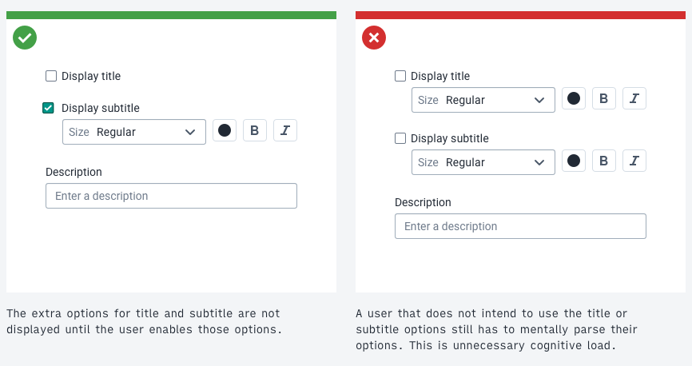
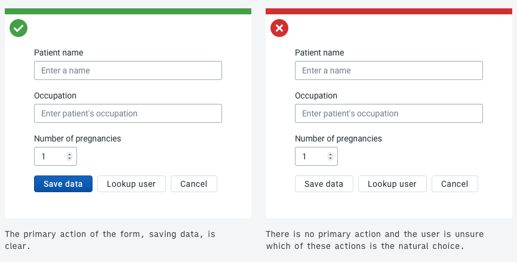
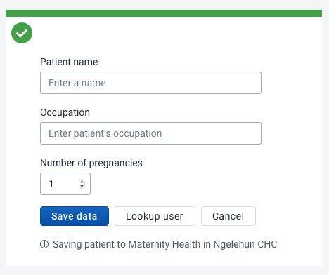
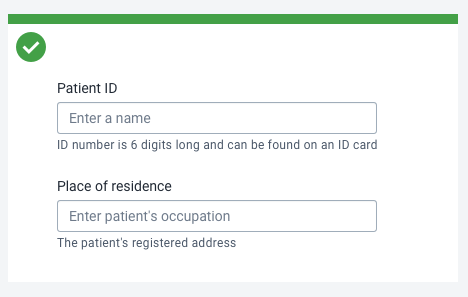
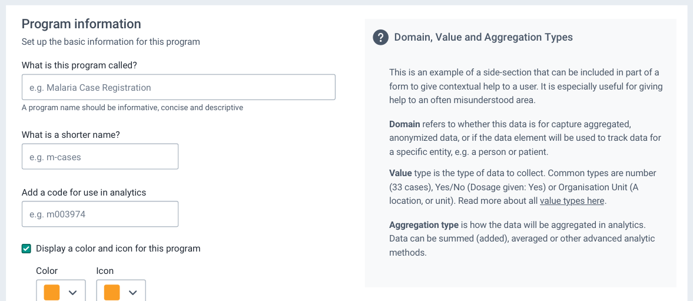

# Forms

Forms are one of the most common ways an application collects user input. Forms accept various types of user input: text, selection, checkboxes and more. DHIS2 applications should follow some common form guidelines to make sure users aren't challenged when working with forms.

## Guidelines

There are many different ways forms can be used, so there are no strict rules to follow. These guidelines help to create a positive user experience.

#### Clarity instead of simplicity

Forms are often used to collect complex data. A form can't always be simple and simplifying complex data can hide important information from a user. Instead of aiming for simplicity, **aim for clarity**.

Clarity means making the purpose and functionality of the form clear to the user. Do this by providing introductory text, help text and feedback. [Using the correct input type](#input-types) also helps create a form that's clear and easy to use.

#### Predictable and logical

The information collected by a form and the method for input should be predictable and logical. Predictability means that a user can expect what information they will need to have ready. Logical means that a form should only require input for the current task. If a form needs to collect information that's not logical or predictable for the user, include help text explaining why that information is required. A user will feel more comfortable inputting data into a form when they understand the process.

#### Progressive disclosure

Progressive disclosure in forms refers to the method of only displaying inputs when they become necessary. Options that relate to another option can be hidden when the main option is disabled. For example, only display a text input for "Title" when a user has checked the box labelled "Display a title". Progressive disclosure keeps forms concise and hides unnecessary complexity until it's required.

While a useful tool, progressive disclosure should be used with caution. The principles of clarity still apply. don't hide form inputs or information that are essential to the user's understanding of a form. Where possible, strike a balance between hiding key information and information overload.

#### Clear purpose

A form should have a purpose that's obvious to the user. A user shouldn't be uncertain about why they're filling in a form or why the information is necessary. Use titles, context and help text to always keep the user informed.

In applications that need to collect information for different purposes it's recommended to use separate forms. Each form should have a focused purpose. Attempting to include too much functionality in a single form can be confusing and overwhelming for users and can lead to technical issues.

#### Feedback at all times

Give feedback to keep users informed. Feedback can be in the form of validation and response to user input. There are different types of validation:

- **Type validation**: a user has entered an invalid data type into an input. For example, entering "ABC" into a number only input. This input type is wrong and the user should be notified immediately along with guidance about how to fix the problem.

- **Content validation**: The data the user has entered isn't considered valid based on the context. A user may have entered "2999" for the "Number of pregnancies" field. This isn't a soft data type validation because the "2999" is the correct type, but it's content is invalid. Connection with a server is often needed for content validation.

- **Response validation**: Informing the user what the status of the form input and response is. "Form successfully submitted" is a type of response validation.

## Input types

Forms are made up of different types of inputs. There are various inputs available in the DHIS2 Design System. The documentation for each input covers when it should and shouldn't be used in detail. The table below summarizes the correct usage of each input type.

| Input                                   | Usage                                                                                                              | Notes                                                                                                                                                             |
| --------------------------------------- | ------------------------------------------------------------------------------------------------------------------ | ----------------------------------------------------------------------------------------------------------------------------------------------------------------- |
| [Text](../atoms/inputfield.md)          | Enter free text input                                                                                              | There are different types of text input that accept different formats. See the input documentation for details.                                                    |
| [Single select](../molecules/select.md) | Select a single option from a list of many                                                                         | A select should be used when there are more than 5–7 options instead of radio buttons.                                                                            |
| [Multi select](../molecules/select.md)  | Select several options from a list                                                                        | A select should be used when there are more than 5–7 options instead of checkboxes                                                                                |
| [Checkbox](../atoms/checkbox.md)        | Single: toggle an option between yes/no, true/false, on/off. Multiple: select multiple options from a list of few. | Single checkboxes must never be a required input as there is no neutral state. don't use a list of checkboxes for many (7+) options, use a multi select instead. |
| [Radio](../atoms/radio.md)              | Select a single option from a list of few                                                                          | don't use a list of radio buttons for many (7+) options, use a single select instead.                                                                            |
| [File input](../atoms/fileinput.md)     | Select a file                                                                                                      | Accepted file type and size should be made clear to the user before uploading                                                                                     |
| [Transfer](../organisms/transfer.md)    | Select and order many options from a list of many in different categories.                                     | Use for complex selections that require specific ordering and filtering of categories.                                                                            |

## Form actions

A form should always have a single, clear primary action. Often this action is 'Submit' or 'Save data'. Make sure the user understands what will happen when they submit a form. More options, like 'Save and add another', can be offered, but only a single primary action should be included. Make sure the action button label accurately describes the action. See the [content and communication section](../principles/content-communication.md) for more information of writing effective button labels.

Form actions should always be placed at the end of the form. When a user is working with critical data or a long, complex form it can be helpful to show help text to remind them of their current context. See the example below.

#### Discarding data

Always make it clear to users what will happen if they abandon a critical form. don't alert users when they abandon search or filtering forms, reserve blocking alerts for only when a user will discard data without saving.

## Help

Offer contextual help inside a form where a user may need it. This is useful for complex forms and forms that a user may not interact with often. Contextual help means that the user doesn't need to search through documentation or visit another site to get help with their current task. 

Often a single line of contextual help underneath a form input is enough to guide the user, as in the examples above.

For complex topics or concepts, an information box can help the user understand a section of a form, as in the example above.

## Complex forms

Complex forms can be difficult for some users to work with. Some users would prefer a complex form to be broken up into several pages or steps. Other users may prefer a large form to be a single long screen. There is no one-size-fits-all approach to designing forms, understanding the intended user is critical to creating forms that will work for that user. Read more about [Designing for the User](design-for-use.md).
